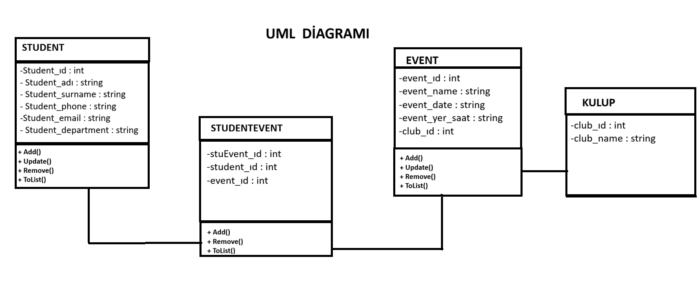

# 🎓 Kulüp Otomasyon Sistemi

<p align="center">


</p>

---

## 📌 Proje Hakkında

Kulüp Otomasyon Sistemi, üniversite kulüplerinin öğrenci ve etkinlik yönetimini dijital ortamda gerçekleştirebilmesi amacıyla geliştirilmiş masaüstü tabanlı bir otomasyon projesidir.

Proje kapsamında;

* Öğrenci kayıt işlemleri
* Etkinlik yönetimi
* Kulüp yönetimi
* Öğrenci – Etkinlik ilişkilendirme işlemleri
* CRUD (Create, Read, Update, Delete) operasyonları
* SQL Server veritabanı işlemleri
* Entity Framework Code First yapısı

gerçekleştirilmiştir.

---

## 🚀 Kullanılan Teknolojiler

| Teknoloji          | Açıklama            |
| ------------------ | ------------------- |
| C#                 | Uygulama geliştirme |
| Windows Forms      | Kullanıcı arayüzü   |
| Entity Framework 6 | ORM Katmanı         |
| SQL Server         | Veritabanı          |
| LINQ               | Veri sorgulama      |
| Git & GitHub       | Versiyon kontrol    |

---

## 📂 Proje Modülleri

### 👨‍🎓 Öğrenci İşlemleri

* Öğrenci ekleme
* Öğrenci güncelleme
* Öğrenci silme
* Öğrenci listeleme

---

### 📅 Etkinlik İşlemleri

* Etkinlik oluşturma
* Etkinlik güncelleme
* Etkinlik silme
* Etkinlik listeleme

---

### 🏢 Kulüp Yönetimi

* Kulüp bilgileri yönetimi
* Etkinliklerin kulüplere bağlanması

---

### 🔗 Öğrenci – Etkinlik İşlemleri

* Öğrenciyi etkinliğe ekleme
* Etkinlik katılımcılarını listeleme
* Katılım kaydını silme
* İstatistiksel sorgulamalar

---

## 🗄️ Veritabanı Yapısı

Projede aşağıdaki tablolar kullanılmaktadır:

### STUDENT

* student_id
* student_name
* student_surname
* student_phone
* student_email
* student_department

### EVENT

* event_id
* event_name
* event_date
* event_yer_saat
* club_id

### CLUB

* club_id
* club_name

### STUDENTEVENT

* stuEvent_id
* student_id
* event_id

---

## 📊 UML Diyagramı

## UML Class Diagram

<p align="center">
  
</p>


---

## 🔄 İlişki Yapısı

```text
CLUB (1)
   |
   |------< EVENT (N)

STUDENT (1)
   |
   |------< STUDENTEVENT >------|
                                |
                                |
                           EVENT (1)
```

Bu yapı sayesinde bir öğrenci birçok etkinliğe katılabilir ve bir etkinlikte birçok öğrenci bulunabilir.

---

## 🎯 Proje Özellikleri

✅ Entity Framework Code First

✅ Foreign Key ilişkileri

✅ Many-to-Many ilişki yönetimi

✅ LINQ sorguları

✅ SQL Server entegrasyonu

✅ CRUD işlemleri

✅ Katılım istatistikleri

✅ Modern Windows Forms arayüzü

---

## 👨‍💻 Geliştirici

**Filiz Yıldırım**

Yönetim Bilişim Sistemleri Öğrencisi

📍 Burdur Mehmet Akif Ersoy Üniversitesi

🔗 GitHub: https://github.com/flz632ylrm-sudo

---

## ⭐ Not

Bu proje eğitim amaçlı geliştirilmiş olup C#, Entity Framework ve SQL Server teknolojileri kullanılarak hazırlanmıştır.
